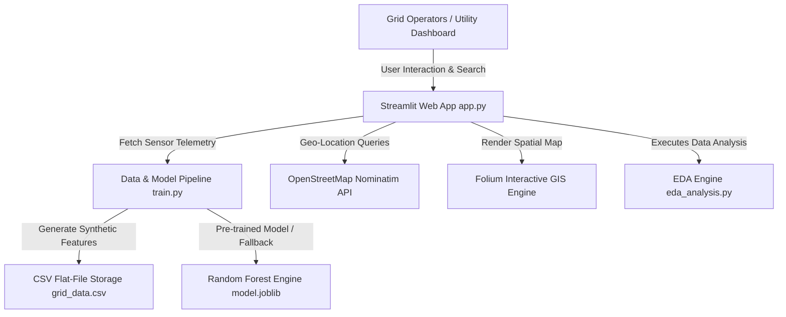

# Architecture

## System Architecture

Our solution is built as a modular Python-based analytics engine with an interactive GIS dynamic web interface. It processes synthetic IoT telemetry and environmental data to generate risk predictions, asset GIS mapping, and automated dispatch directives.

## Components

| Component | Technology | Responsibility |
|---|---|---|
| **Frontend & UI** | Streamlit, Folium | Interactive web dashboard, map visualization, and crew dispatch controls. |
| **Analytics Engine** | Pandas, NumPy | Data preprocessing, risk feature engineering, and EDA metric calculations. |
| **AI / Machine Learning** | Scikit-Learn (Random Forest), Joblib | Equipment failure prediction, risk severity scoring, and model serialization. |
| **Geospatial Services** | OpenStreetMap (Nominatim API) | Geocoding substation addresses to live latitude/longitude coordinates. |
| **Data Storage** | CSV File System | Lightweight local persistence for generated synthetic grid telemetry logs. |

## Data Flow

The NeuralGrid telemetry analytics engine processes system data sequentially from synthetic generation to interactive GIS mapping and crew alert advisories:

1. **Synthetic Telemetry Generation:** Running `train.py` synthesizes IoT sensor metrics (transformer oil temperature, gas PPM, vibration, ambient weather factors) and persists them to `grid_data.csv`.
2. **Model Training & Scoring:** Features are passed to the Scikit-Learn Random Forest pipeline to compute asset risk probability scores and save the binary model (`model.joblib`).
3. **Analytics Processing:** `eda_analysis.py` evaluates substation-wise health breakdowns, financial outage impact predictions, and failure rate statistics.
4. **Interactive GIS Rendering:** `app.py` loads the dataset and model, queries OpenStreetMap Nominatim API for location coordinates, and plots color-coded risk markers on a Folium map.
5. **Crew Dispatch Advisories:** The dashboard evaluates severity thresholds and automatically triggers priority crew dispatch recommendations based on predicted customer impact.

## Security Considerations

- API endpoints (OpenStreetMap) use standard HTTPS connections and are query-throttled to abide by provider usage policies.
- No sensitive utility grid credentials, private keys, or API tokens are hardcoded or committed to the git repository.
- Local fallback mechanisms ensure secure offline execution without exposing internal system infrastructure details.

## Scalability Notes

The current architecture relies on local flat-file storage and a Streamlit dashboard. To scale NeuralGrid for production deployment:

- **Distributed IoT Streaming:** Replace flat CSV files with high-throughput time-series databases (e.g., PostgreSQL with TimescaleDB or Apache Kafka) for real-time sensor data ingestion.
- **Microservices Deployment:** Decouple the ML inference pipeline into containerized REST API endpoints (e.g., IBM Code Engine / FastAPI) to handle parallel requests across large-scale utility grids.

[e.g., "The FastAPI backend is stateless and could be horizontally scaled behind a load balancer. The watsonx.ai calls are the bottleneck and would benefit from request batching."]
